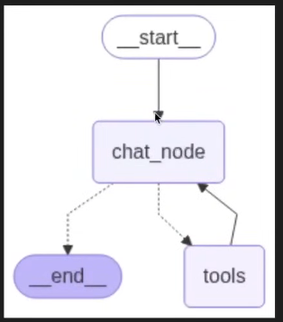
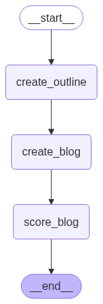
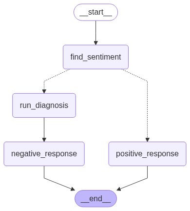
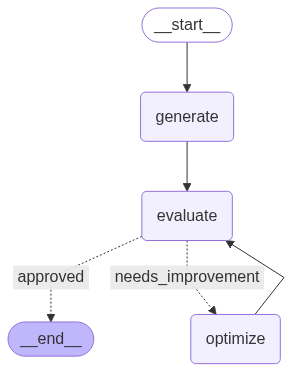

# **Features of Agentic AI Chatbots**

##### 1. **Autonomy**

* **Goal-driven behavior**: Can independently set subgoals and execute tasks toward a main objective.
* **Initiative taking**: Acts without waiting for user prompts (e.g., offering to do something based on context).
* **Long-term memory**: Remembers user preferences, goals, or past interactions to adjust future behavior.
* **Session continuity**: Maintains context across sessions and resumes where left off.

##### 2. **Reasoning & Planning (Cognitive Capabilities)**

* **Multi-step task planning**: Breaks down complex tasks into logical sequences.
* **Chain-of-thought reasoning or Logical chaining**: Explains steps in its decision-making.
* **Constraint handling**: Considers limitations, deadlines, and conflicting objectives.

##### 3. **Adaptability & Continuous Learning**

* **On-the-fly learning**: Learns from new data or user feedback during interaction.
* **Personalization**: Customizes responses based on user personality, tone, and goals.
* **Behavioral adjustment or feedback loop**: Adapts strategy based on success/failure of previous actions.
* **Retraining from Logs or Feedback**: Can fine-tune on domain-specific logs (e.g., support chats, tickets, resolutions), Incorporates user corrections into behavior.
* **Self-improvement Objectives**: Monitors KPIs (e.g., success rate, time to solve) and adjusts strategies to improve.
* **Plugin / Tool Performance Scoring**: Tracks which plugins/tools work best in different contexts and prioritizes them.

##### 4. **Advanced Natural Language Processing**

* **Contextual understanding or Multi-turn dialogue**: Tracks and interprets ongoing conversation with awareness of history.
* **Multi-modal input**: Understands text, voice, image, and file inputs.
* **Multi-language support**: Communicates fluently in multiple languages.
* **Sentiment and intent detection**: Understands user mood and purpose.

##### 5. **Multi-turn Dialogue Handling**

* **Back-and-forth flow**: Handles long, complex conversations without losing track.
* **Clarification prompts**: Asks questions to resolve ambiguity.
* **Interrupt and resume**: Can handle interruptions gracefully and return to previous tasks.

##### 6. **Autonomous Task Execution using Tool & Integration**

* **Tool calling**: Can use external tools/APIs like search engines, calculators, databases, etc.
* **App/plugin integrations**: Interfaces with calendars, CRMs, emails, etc.
* **Multi-agent collaboration**: Coordinates with other AI agents or humans for complex workflows.

##### 7. **Environment Interaction**

* **Web browsing**: Searches and extracts relevant, up-to-date info.
* **File handling**: Reads/writes documents, code, spreadsheets.
* **Real-world API actions**: Sends emails, schedules meetings, creates tickets, triggers workflows.

##### 8. **Control & Alignment & Ethics & Governance & Security & Compliance**

* **Value alignment**: Ensures behavior aligns with user values and ethical norms.
* **Safety constraints or Data privacy**: Obeys guardrails like do-not-do rules or data privacy laws.
* **Explainability**: Can explain why it took a particular action.
* **User approval gating**: Seeks permission before executing sensitive tasks.
* **Escalation to Human Agents / Human-in-the-Loop / Hybrid Control**: Seamlessly hands off to a human when the task is too ambiguous, risky, or sensitive, Includes full context transfer to the human counterpart.
* **Approval-based Actions**: Certain actions (e.g., sending payment, deleting data) require explicit human approval.
* **Role-based Access Control (RBAC)**: User-specific permissions for executing sensitive or destructive tasks, Fine-grained control over tool access (e.g., only admins can call `delete_user`).
* **Audit Logging**: Logs all actions taken by the agent: what, why, when, who initiated, Helps with compliance (e.g., GDPR, HIPAA, SOC2).
* **Prompt Injection & Jailbreak Detection**: Real-time detection and mitigation of malicious inputs or prompt tampering, Input sanitization and containment strategies.
* **Secure Tool Execution**: Runs shell commands, code, or tools in sandboxes or containers (e.g., Docker, Firecracker), Prevents code execution from escaping the controlled environment.

##### 9. **Agentic Architecture & Infrastructure Support**

* **Memory modules**: Separate short-term and long-term memory systems.
* **Planning modules**: Components responsible for action sequencing and prioritization.
* **Critique/self-reflection modules or long-term adaptation**: Evaluates its own performance and revises plans.
* **High Availability & Fault Tolerance**: Distributed deployment to ensure no single point of failure, Auto-recovery from crashes or broken task chains, Retry mechanisms for failed steps or external API timeouts.
* **Scalability**: Supports dynamic workload scaling (horizontal/vertical), Multi-user and multi-agent orchestration without latency spikes.
* **Task Persistence & Resumability**: Can pause and resume long-running tasks (e.g., across sessions or after server restart), Tracks task state in a persistent store (e.g., Redis, vector DB, etc.).

##### 10. **Multi-agent Systems**

* **Task delegation**: Assigns subtasks to specialized agents.
* **Collaboration protocols**: Communicates and negotiates between agents.
* **Shared memory/context**: Maintains a common knowledge base across agents.
* **Multi-agent Task Arbitration**: Agents can negotiate or vote on decisions, Conflict resolution protocols (e.g., consensus, majority, rule-based overrides).

##### 11. **Operations & Lifecycle Management**

* **Versioning & Rollbacks**: Tracks versions of agents, tools, prompts, and plans, Can revert to previous configurations or workflows if issues arise.
* **Dynamic Agent Configuration**: Allows real-time agent behavior tuning (e.g., temperature, planning depth, etc.) via UI or API, Agents can be upgraded, disabled, or redirected on the fly.
* **Hot-Swapping Skills/Tools**: Dynamically load/unload plugins/tools/APIs, Auto-discover or fetch new capabilities from registries or repositories.

##### 12. **Agent Collaboration & Governance**

* **Agent Hierarchies and Delegation Policies**: Agents can spawn or command sub-agents with scoped permissions, Parent-child agent task hierarchies for traceability and control.
* **Agent Registry and Metadata**: Central registry of available agents with descriptions, capabilities, and usage metrics.

##### 13. **Observability & Debugging**
* **Task Traceability / Visual Logs**: Full, step-by-step visual trace of agent thinking and actions, Allows debugging task failures or incorrect reasoning chains.
* **Health Monitoring & Alerts**: Real-time status of agent, tools, and memory systems, Auto-alerts on degraded performance or failures.
* **Feedback Loops**: User thumbs-up/down or comments directly impact agent scoring or future planning.

##### 14. **Domain Adaptation & Knowledge Management**
* **Enterprise Knowledge Graphs / Ontologies**: Integrates with structured data systems (e.g., product catalogs, internal wikis), Links concepts intelligently for richer reasoning.
* **Vector Store-Backed Memory**: Stores long-term memory, embeddings, and documents in semantic vector databases (e.g., Pinecone, Weaviate), Enables retrieval-augmented generation (RAG) across domain-specific knowledge.

| Domain & Industry  | Example Use Case                                                               |
| ------------------ | ------------------------------------------------------------------------------ |
| Personal Assistant | Proactively scheduling your week based on past habits and upcoming goals       |
| Customer Service   | Troubleshooting, escalating, and resolving issues across channels autonomously |
| Development Agent  | Writing, testing, debugging, and documenting code automatically                |
| Research Assistant | Gathering data, summarizing papers, generating insights with minimal guidance  |
| Operations Agent   | Monitoring dashboards, automating responses, adjusting parameters dynamically  |
| Finance            | RBAC, audit logs, human approval for transactions                              |
| Healthcare         | HIPAA compliance, secure memory, human escalation for diagnoses                |
| Customer Support   | Auto-escalation, hot-swapping tools, retraining from logs                      |
| DevOps             | Shell sandboxing, retries, rollback systems                                    |
| E-commerce         | Knowledge graph for products, scalable memory, RAG with order history          |

##### Basic Chatbot Features
* **Quick Replies / Buttons** UI shortcuts to guide conversation.
* **Fallback Handling**       Gracefully manages unknown inputs ("Sorry, I didn’t understand").
* **FAQs Handling**           Responds instantly to predefined frequent questions.
* **Multichannel Support**    Works across web, WhatsApp, Messenger, etc.
* **Typing Indicators**       Shows bot is "typing" for realism.
* **Conversation Handoff**    Transfers to human when needed.
* **User Session Timeout**    Ends or resets inactive chats cleanly.
* **Language Detection**      Auto-detects and switches language if needed.
* **Small Talk**              Handles greetings, jokes, chit-chat.
* **Anonymity Option**        Can chat without needing personal data.

# Agentic AI using LangGraph

NOTE: We can use any other framework to make the Agentic AI, however, we are using LangChain.


## Curriculum: 
1. Foundation of Agentic AI
2. LangGraph Fundamentals
3. Advanced LangGraph
4. AI Agents
5. Agentic RAG
6. Productanization

## Generative AI vs Agentic AI

### Generative AI refers to a class of artificial intelligence models that can create new content - such as text, images, audio, video, or code - that resembles human-created data. Generative AI is about learning the distribution of data so that it can generate a new sample from it, while, Traditional AI is about fining patterns in data and giving predictions. Example: ChatGPT, CodeLLama, Delli, Elevenlabs, Sora etc are used to creative and business writing, software development, customer support, eduction, designing, . It is constantly evolving and improving. Generative AI or LLM can generate generic data but, RAG base AI or LLM generate specific data for my use, but, both don't have memory, cannot take action and reactive (only give response to a query, never initiated itself reply or action).  

### Agentic AI aims at solving a problem using generative AI and take approval/review from the client before taking action. It is proactive (autonomous i.e. can initiate action itself), has memory to remember past, give specific ouput/data, take take action and can adopt to any unseen changes. Example: we can integrate API of services and Agentic AI can use the API to perform the specified task end to end.

# What is Agentic AI?
Agentic Al is a type of Al that can take up a task or goal from a user and then work toward completing it on its own, with minimal human guidance. It plans, takes action, adapts to changes, and seeks help only when necessary. It is an intelligent system that receives a high-level goal from a user, and autonomously plans, decides, and executes a sequence of actions by using external tools, APIs, or knowledge sources — all while maintaining context, reasoning over multiple steps, adapting to new information, and optimizing for the intended outcome.


## Key characterstics of Agentic AI
###  Autonomous
Autonomy refers to the Al system's ability to make decisions and take actions on its own to achieve a given goal, without needing step-by-step human instructions.

1. Our Al recruiter is autonomous

2. It's proactive

3. Autonomy in multiple facets

- Execution
- Decision making
- Tool usage

4. Autonomy can be controlled

- **Permission Scope** - Limit what tools or actions the agent can perform independently. (Can screen candidates, but needs approval before rejecting anyone.)
- **Human-in-the-Loop (HITL)** - Insert checkpoints where human approval is required before continuing. (Can I post this JD)
- **Override Controls** - Allow users to stop, pause, or change the agent's behaviour at any time. (pause screening command to halt resume processing.)
- **Guardrails / Policies** - Define hard rules or ethical boundaries the agent must follow. (Never schedule interviews on weekends)

5. Autonomy can be dangerous

- The application autonomously sends out job offers with incorrect salaries or terms.
- The application shortlists candidates by age or nationality, violating anti-discrimination laws. 
- The applications spending extra on Linkedin ads.

### Goal Oriented
Being goal-oriented means that the Al system operates with a persistent objective in mind and continuously directs its actions to achieve that objective, rather than just responding to isolated prompts.

1. Goals acts as a compass for Autonomy

2. Goals can come with constraints

3. Goals are stored in core memory

```json
{
"main_goal": "Hire a backend engineer",
"constraints": {
    "experience":"2-4 years",
    "remote": true,
    "stack": ["Python", "Django", "Cloud"]
},
"status": "active",
"created_at":"2025-06-27",
"progress": {
    "JD_created": true,
    "posted_on": ["LinkedIn", "AngelList"],
    "applications_received": 8,
    "interviews_scheduled": 2
    }
}
```

4. Goals can be altered

### Planning
Planning is the agent's ability to break down a high-level goal into a structured sequence of actions or subgoals and decide the best path to achieve the desired outcome.

Step 1: Generating multiple candidate plans
- Plan A: Post JD on LinkedIn, GitHub Jobs, AngelList
- Plan B: Use internal referrals and hiring agencies

Step 2: Evaluate each plan
- Efficiency (Which is faster?)
- Tool Availability (Which tools are available)
- Cost (Does it require premium tools?)
- Risk (Will it fail if we get no applicants?)
- Alignment with constraints (remote-only? budget?)

Step 3: Select the best plan with the help of:
- Human-in-the-loop input (e.g., "Which of these options do you prefer?")
- A pre-programmed policy (e.g., "Favor low-cost channels first")

### Reasoning

Reasoning is the cognitive process through which an agentic ai system interprets information, draws conclusions, and makes decisions - both while planning ahead and while executing actions in real time.

**Reasoning During Planning**:

1. **Goal decomposition** - Break down abstract goals into concrete steps
2. **Tool selection** - Decide which tools will be needed for which steps
3. **Resource estimation** - Estimate time, dependencies, risks

**Reasoning During Execution**:

1. **Decision-making** - Choosing between options (3 candidates match → schedule 2 best, reject 1) 
2. **HITL handling** - Knowing when to pause and ask for help (Unsure about salary range)
3. **Error handling** - Interpreting tool/API failures and recovering

### Adaptability

Adaptability is the agent's ability to modify its plans, strategies, or actions in response to unexpected conditions - all while staying aligned with the goal.

1. Failures (Calendar API)
2. External feedback (Less no of applications)
3. Changing goals (Hiring a freelancer)

### Context Awareness

Context awareness is the agent's ability to understand, retain, and utilize relevant information from the ongoing task, past interactions, user preferences, and environmental cues to make better decisions throughout a multi-step process.
1. **Types of context**

- **The original goal**
- **Progress till now + Interaction history** (Job description was finalized and posted to LinkedIn & GitHub Jobs)
- **Environment state** (Number of applicants so far = 8 or LinkedIn promotion ends in 2 days)
- **Tool responses** (Resume parser → "Candidate B has 3 years Django + AWS experience or Calendar API "No conflicts at 2 PM Wednesday)
- **User specific preferences** (Prefers remote-first candidates or Likes receiving interview questions in a Google Doc)
- **Policy or Guardrails**(Do not send offer without explicit user approval or Never use platforms that require paid ads unless approved)

2. **Context awareness is implemented through memory**

3. **Short term memory**

4. **Long term memory**

## Components of Agentic AI
### **Brain**

**Goal Interpretation** : Understands user instructions and translates them into objectives.
**Planning** : Breaks down high-level goals into subgoals and ordered steps.
**Reasoning** : Makes decisions, resolves ambiguity, and evaluates trade-offs.
**Tool Selection** : Chooses which tool(s) to use at a given step.
**Communication** : Generates natural language outputs for humans or other agents.
example: llm

### **Orchestrator**

**Task Sequencing** : Determines the order of actions (step 1-step 2 →...).
**Conditional Routing** : Directs flow based on context (e.g., if failure, retry or escalate).
**Retry Logic** : Handles failed tool calls or reasoning attempts with backoff.
**Looping & Iteration** : Repeats steps (e.g., keep checking job apps until 10 are received).
**Delegation** : Decides whether to hand off work to tools, LLM, or human.
example: LangGraph, Microsoft AutoGen, CrewAI and Semantic Kernel etc.

### **Tools**

**External Actions** : Perform API calls (e.g., post a job, send an email, trigger onboarding).
**Knowledge Base Access** : Retrieve factual or domain-specific information using RAG or search tools to ground responses.
example: API

### **Memory**

**Short-Term Memory** : Maintains the active session's context-recent user messages, tool calls, and immediate decisions.
**Long-Term Memory** : Persists high-level goals, past interactions, user preferences, and decisions across sessions.
**State Tracking** : Monitors progress: what's completed, what's pending (e.g., "JD posted", "Offer sent").

### **Supervisor**

**Approval Requests (HITL)** : Agent checks with human before high-risk actions (e.g., sending offers).
**Guardrails Enforcement** : Blocks unsafe or non-compliant behavior.
**Edge Case Escalation** : Alerts humans when uncertainty/conflict arises.

## Tools:
A tool is just a Python function (or API) that is packaged in a way the LLM can understand and call when needed. NOTE: These tools are also runnables. Documentation and list of all available tools https://python.langchain.com/docs/integrations/tools/.
LLMS (like GPT) are great at:
    • Reasoning(Think)
    • Language generation(Text Generation or Speak)
But they can't do things like:
    • Access live data (weather, news)
    • Do reliable math(difficult mathematics)
    • Call APIs(post a tweet on tweeter)
    • Run code
    • Interact with a database


### How Tools fits into the Agent ecosystem?
An Al agent is an LLM-powered system that can autonomously think, decide, and take actions using external tools or APIs to achieve a goal.


**Built-in Tools**: A built-in tool is a tool that LangChain already provides for you -it's pre-built, production- ready, and requires minimal or no setup. You don't have to write the function logic yourself - you just import and use it.
    DuckDuckGoSearchRun     Web search via DuckDuckGo
    WikipediaQueryRun       Wikipedia summary
    PythonREPLTool          Run raw Python code
    ShellTool               Run shell commands
    RequestsGetTool         Make HTTP GET requests
    GmailSendMessageTool    Send emails via Gmail
    SlackSendMessageTool    Post message to Slack
    SQLDatabaseQueryTool    Run SQL queries

**Custom Tools**
A custom tool is a tool that you define yourself.
Use them when:
    • You want to call your own APIs
    • You want to encapsulate business logic
    • You want the LLM to interact with your database, product, or app

Ways to create Custom Tools
    • using @tool decorator
    • using Structured Tool & Pydantic
    • Using Base Tool class


A **Structured Tool** in LangChain is a special type of tool where the input to the tool follows a structured schema, typically defined using a Pydantic model. The best way to make enforce constants and most used in production.

**BaseTool** is the abstract base class for all tools in LangChain. It defines the core structure and interface that any tool must follow, whether it's a simple one-liner or a fully customized function.
All other tool types like **@tool, Structured Tool** are built on top of BaseTool. Used to perform multiple asynchronous functions unlike in tool decorator and Structured Tool.


**Toolkits**: A toolkit is just a collection (bundle) of related tools that serve a common purpose- packaged together for convenience and `reusability`.
In LangChain:
    • A toolkit might be: GoogleDriveToolKit
    • And it can contain the following tools
    • `GoogleDriveCreateFileTool`: Upload a file
    • `GoogleDriveSearchTool`: Search for a file by name/content
    • `GoogleDriveReadFileTool`: Read contents of a file

**Tool Binding** is the step where you register tools with a Language Model (LLM) so that:
1. The LLM knows what tools are available
2. It knows what each tool does (via description)
3. It knows what input format to use (via schema)

## Tool Calling:
It is the process where the LLM (language model) decides, during a conversation or task, that it needs to `use a specific tool (function)` — and generates a structured output with:
- the `name of the tool`
- and the `arguments` to call it with

The LLM `does not actually run the tool` - it just `suggests` the tool and the input arguments. The `actual execution is handled by LangChain or you`.

"What's 8 multiplied by 7?"
The LLM responds with a tool call:

```json
{
"tool": "multiply",
"args": { "a": 8, "b": 7 }
}
```


In LangGraph, a **ToolNode** is a prebuilt node type that acts as a bridge between your graph and external tools (functions, APIs, utilities).
• Normally in LangGraph you'd write a node function yourself: it takes in state and returns state.
• A ToolNode is a ready-made node that knows how to handle a list of LangChain tools.
• Its job: listen for tool calls from the LLM (like "call search()" or "get_weather()") and automatically route the request to the correct tool, then pass the tool's output back into the graph.
**tools_condition** is a prebuilt conditional edge function that helps your graph decide:
"Should the flow go to the ToolNode next, or back to the LLM?"

**Tool Execution** is the step where the **actual Python function (tool)** is run using the input arguments that the **LLM suggested during tool calling**.

In simpler words:
    The LLM says:
    "Hey, call the `multiply` tool with a=8 and b=7,"
    Tool Execution is when you or LangChain actually run:
    `multiply(a=8, b=7)`
    → and get the result: `56`



## **ReAct** : 
ReAct is a design pattern used in AI agents that stands for Reasoning + Acting. It allows a language model (LLM) to interleave internal reasoning (Thought) with external actions (like tool use) in a structured, multi-step process.
Instead of generating an answer in one go, the model thinks step by step, deciding what it needs to do next and optionally calling tools (APIs, calculators, web search, etc.) to help it. It loop over `thought`, `action` and `observation`(`answer`) till get the `final answer`.

```bash
Thought: I need to find the capital of France.
Action: search_tool
Action Input: "capital of France"
Observation: Paris

Thought: Now I need the population of Paris.
Action: search_tool
Action Input: "population of Paris"
Observation: 2.1 million

Thought: I now know the final answer.

Final Answer: Paris is the capital of France and has a population of ~2.1 million.
```

ReAct is useful for:
- Multi-step problems
- Tool-augmented tasks (web search, database lookup, etc.)
- Making the agent's reasoning `transparent and auditable`

It was first introduced in the paper:
    "ReAct: Synergizing Reasoning and Acting in Language Models" (Yao et al., 2022)

### Create the ReAct agent
```bash
agent = create_react_agent(
    llm=llm,
    tools=[search_tool, get_weather_data],
    prompt=prompt
)
```

### langchain's hub's ReAct Template:
```bash
Answer the following questions as best you can. You have access to the following tools:

{tools}

Use the following format:

Question: the input question you must answer
Thought: you should always think about what to do
Action: the action to take, should be one of [{tool_names}]
Action Input: the input to the action
Observation: the result of the action
... (this Thought/Action/Action Input/Observation can repeat N times)
Thought: I now know the final answer
Final Answer: the final answer to the original input question

Begin!

Question: {input}
Thought:{agent_scratchpad}
```

**Agent & Agent Executor**
`AgentExecutor` orchestrates the `entire loop`:
1. Sends inputs and previous messages/thought trace/Agent Scratchpad(initially empty) to the agent 
2. Gets the next `action` from agent
3. Executes that tool with provided input
4. Adds the tool's `observation` back into the history
5. Loops again with updated history until the agent says `Final Answer`.


### Creating Agent Executor
```bash
agent_executor = AgentExecutor(
    agent=agent,
    tools=[search_tool, get_weather_data],
    verbose=True # To show what the agent is thinking.
)
```

## Example of AI Agent in details.
Input Query:
    "What is the capital of France and what is its population?"

Answer the following questions as best you can. You have cess to the following tools:

search_tool: Useful for answering general knowledge questions by querying a search API.

Use the following format:

Question: the input question you must answer
Thought: you should always think about what to do
Action: the action to take, should be one of [search_tool]
Action Input: the input to the action
Observation: the result of the action
... (this Thought/Action/Action Input/Observation can repeat N times) Thought: I now know the final answer
Final Answer: the final answer to the original input question

Begin!

Question: What is the capital of France and what is its population? 
Thought:


Thought: I need to find the capital of France first. 
Action: search_tool
Action Input: "capital of France"

AgentAction(
    tool="search_tool",
    tool_input="capital of France",
    log="Thought: I need to find the capital of France first."
)


observation = search_tool("capital of France")      "Paris is the capital of France"

Thought: I need to find the capital of France first.
Action: search_tool
Action Input: "capital of France"
Observation: Paris is the capital of France.


Current state so far:
- User Input:
    `What is the capital of France and what is its population?`
- Agent Scratchpad after Step 2:

```bash
Thought: I need to find the capital of France first.
Action: search_tool
Action Input: "capital of France"
Observation: Paris is the capital of France.
```

Answer the following questions as best you can. You have access to the following tools


search tool: Useful for answering general knowledge questions by querying a search API.

Use the following format:

Question: the input question you must answer
Thought: you should always think about what to do
Action: the action to take, should be one of [search_tool]
Action Input: the input to the action
Observation: the result of the action
... (this Thought/Action/Action Input/Observation can repeat Il times)
Thought: I now know the final answer
Final Answer: the final answer to the original input question

Begin!


Question: What is the capital of France and what is its population? Thought: need to find the capital of France first.
Action: search_tool
Action Input: "capital of France"
Observation: Paris is the capital of France.
Thought:

Thought: Now I need to find the population of Paris.
Action: search_tool
Action Input: "population of Paris"


AgentAction(
    tool="search_tool",
    tool_input="population of Paris",
    log="Thought: Now I need to find the population of Paris."
)

observation = search_tool("population of Paris")   "Paris has a population of 2.1 million.


Thought: I need to find the capital of France first. Action: search_tool
Action Input: "capital of France"
Observation: Paris is the capital of France.
Thought: Now I need to find the population of Paris.
Action: search_tool
Action Input: "population of Paris"
Observation: Paris has a population of approximately 2.1 million.


Answer the following questions as best you can. You have access to the following tools:

search_tool: Useful for answering general knowledge questions by querying a search API.

Use the following format:

Question: the input question you must answer
Thought: you should always think about what to do
Action: the action to take, should be one of [search_tool]
Action Input: the input to the action
Observation: the result of the action
...(this Thought/Action/Action Input/Observation can repeat N times)
Thought: I now know the final answer
Final Answer: the final answer to the original input question

Begin!


Question: What is the capital of France and what is its population? Thought: I need to find the capital of France first.
Action: search_tool
Action Input: "capital of France"
Observation: Paris is the capital of France.
Thought: Now I need to find the population of Paris.
Action: search_tool
Action Input: "population of Paris"
Observation: Paris has a population of approximately 2.1 million.
Thought:

Thought: I now know the final answer.
Final Answer: Paris is the capital of France and has a population of approximately 2.1 million.


AgentFinish(
return_values={"output": "The capital of France is Paris..."},
log="Thought: I now know the final answer. \nFinal Answer: ..."
)

{
"output": "Paris is the capital of France and has a population of approximately 2.1 million."
}


# What is Langchain?
LangChain is an open-source library designed to simplify the process of building LLM based applications. It provides modular building blocks that let you create sophisticated LLM-based workflows with ease. LangChain can be used to create Simple conversational workflows like Chatbots, Text Summarizers, Multistep workflows, RAG applications, Basic level agents etc.

### LangChain consists of multiple components
- **Model** components gives use a unified interface to interact with various LLM providers
- **Prompts** component helps you engineer prompts
- **Retrievers** component helps you fetch relevant documents from a vector store
- **Chains** component helps to create chain of more than one langchain components.

    BaseMessage is the base message capable to storing all message incluing HumanMessage, AIMessage, SystemMessage etc.
    add_messages is a Reducer function to prevent from preventing erasing when adding the new message

# What is LangGraph?
**LangGraph** is an orchestration framework that enables you to build **stateful**, **multi-step**, and **event-driven** workflows using large language models (LLMs). It's ideal for designing both **single-agent** and **multi-agent** agentic Al applications.
Think of LangGraph as a **flowchart engine for LLMs** - you define the steps (nodes), how they're connected (edges), and the logic that governs the transitions. LangGraph takes care of **state management**, **conditional branching**, **looping**, **pausing/resuming**, and **fault recovery** - features essential for building robust, production-grade Al systems.

### LangChain Vs LangGraph
- Workflow used in LangChain is created by developer and remain the same, while workflow used in LangGraph is created by the LLM by directing their own processes and tool usage, mainitaining control over how they accomplish tasks.
- LangChain is stateless an, while LangGraph is statefull.
- LangChain is used when you're building simple, linear workflows like a prompt chain, summarizer, or a basic retrieval system, while LangGraph is used when the case involves complex, non-linear workflows that need Conditional paths, Loops, Human-in-the-loop steps, Multi-agent coordination, Asynchronous or event-driven execution etc.

### Why LangGraph exits?

- **Control Flow Complexity** in LangChain because of glue codes (conditional branches, jumps and loops), while no glue code in LangGraph.
- dificulty in **State Handling** (**Data handling**) i.e. manually have to update the state of the workflow, while in LangGrahp, we create a state object with the help of Pydantic or typedict and each node get the state update its value and return the state again.
- LangChain execute in **sequential** fashion, while LangGraph do **Event Driven** Execution.
- LangChain is not **Fault Tolerant** than LangGraph. LangGraph offer small level fault (retry logic), big/system level fault (recovery using checkpointers). 
- LangChain cannot handle **Human in the Loop** for long time.
- **Nested Workflows** each node in the graph can itself be a complete graph. the subgraphs created using it helps to create multiagent system and increase reusability.
- **Observability** is partial and difficult in LangChain, but easy in LangGraph. This is one using **LangSmith**.
- LangGraph is built on top of LangChain (LangGraph doesn't replace LangChain). LangGraph handles workflow orchestration, while LangChain provides the building blocks (ChatOpenAI (LLMs), PromptTemplate, Retrievers, Document Loaders, Tools, etc.) for each step in that workflow.

### LLM workflow
1. LLM workflows are a step by step process using which we can build complex LLM applications.
2. Each step in a workflow performs a distinct task - such as prompting, reasoning, tool calling, memory access, or decision-making.
3. Workflows can be linear, parallel, branched, or looped, allowing for complex behaviours like retries, multi-agent communication, or tool-augmented reasoning.
4. Common workflows


### Graphs, Nodes and Edges
The system generates an essay topic, collects the student's submission, and evaluates it in parallel on depth of analysis, language quality, and clarity of thought. Based on the combined score, it either gives feedback for improvement or approves the essay.

1. **Generate Topic**
- System generates a relevant UPSC-style essay topic and presents it to the student.
2. **CollectEssay**
- Student writes and submits the essay based on the generated topic.
3. **EvaluateEssay (Parallel Evaluation Block)**
- Three evaluation tasks run in **parallel**:
- **EvaluateDepth** - Analyzes depth of analysis, argument strength, and critical thinking.
- **EvaluateLanguage** - Checks grammar, vocabulary, fluency, and tone.
- **EvaluateClarity** - Assesses coherence, logical flow, and clarity of thought.
4. **AggregateResults**
- Combines the three scores and generates a total score (e.g., out of 15).
5. **Conditional Routing**
- Based on the total score:
- If score meets threshold go to ShowSuccess
- If score is below threshold go to GiveFeedback
6. **GiveFeedback**
- Provides targeted suggestions for improvement in weak areas.
7. **CollectRevision** (optional loop)
- Student resubmits the revised essay.
- Loop back to **EvaluateEssay**
8. **ShowSuccess**
- Congratulates the student and ends the flow.


### State
In LangGraph, state is the shared memory that flows through your workflow - it holds all the data being passed between nodes as your graph runs.

```python
    essay text: str
    topic: str
    depth_score: int
    language_score: int
    clarity_score: int
    total_score: int
    feedback: Annotated [list[str], add]
    evaluation_round: int
```

### Reducers,
Reducers in LangGraph define how updates from nodes are applied to the shared state. Each key in the state can have its own reducer, which determines whether new data replaces, merges, or adds to the existing value.

### LangGraph Execution Model

It is inspired by Google Pragal that processes large scale graphs.

1. **Graph Definition**

You define:
- The **state schema**
- **Nodes** (functions that perform tasks)
- **Edges** (which node connects to which)

2. **Compilation**

You call `.compile()` on the `StateGraph`. This checks the graph structure and prepares it for execution.

3. **Invocation**

You run the graph with `.invoke(initial_state)`. LangGraph sends the initial state as a **message** to the entry node(s).

4. **Super-Steps Begin**
Execution proceeds in **rounds**. In each round (super-step):
- All **active nodes** (those that received messages) run in **parallel**
- Each returns an **update** (message) to the state

5. **Message Passing & Node Activation**
The messages are passed to downstream nodes via edges. Nodes that receive messages become active for the **next round**.

6. **Halting Condition**
Execution stops when:
- No nodes are active, and
- No messages are in transit

## Sequential Workflows
 Prompt Chaining: It is also called as prompt chaining as output of one is input for the next node.



```python
# nodes
graph.add_node('create_outline',create_outline)
graph.add_node('create_blog',create_blog)
graph.add_node('score_blog',score_blog)

# edges
graph.add_edge(START, 'create_outline')
graph.add_edge('create_outline', 'create_blog')
graph.add_edge('create_blog', 'score_blog')
graph.add_edge('score_blog', END)
```

## Parallel Workflows

    For parallel workflow, each nodes must return the required part of the state only.
    While, for others we can send the whole state. But, to keep it simple, we can just use required part of the state for nodes.
```python
# nodes
graph.add_node("evaluate_language", evaluate_language)
graph.add_node("evaluate_analysis", evaluate_analysis)
graph.add_node("evaluate_thought", evaluate_thought)
graph.add_node("final_evaluation", final_evaluation)

# nodes : Fan-out → join
graph.add_edge(START, "evaluate_language")
graph.add_edge(START, "evaluate_analysis")
graph.add_edge(START, "evaluate_thought")
graph.add_edge("evaluate_language", "final_evaluation")
graph.add_edge("evaluate_analysis", "final_evaluation")
graph.add_edge("evaluate_thought", "final_evaluation")
graph.add_edge("final_evaluation", END)
```

## Conditional Workflows

```python
graph.add_node('find_sentiment', find_sentiment)
graph.add_node('positive_response', positive_response)
graph.add_node('run_diagnosis', run_diagnosis)
graph.add_node('negative_response', negative_response)

graph.add_edge(START, 'find_sentiment')
graph.add_conditional_edges('find_sentiment', check_sentiment) # check_condition will fit the correct function.

graph.add_edge('positive_response', END)

graph.add_edge('run_diagnosis', 'negative_response')
graph.add_edge('negative_response', END)
```



## Iterative Workflows

```python
graph.add_node('generate_tweet', generate_tweet)
graph.add_node('evaluate_tweet', evaluate_tweet)
graph.add_node('optimize_tweet', optimize_tweet)

graph.add_edge(START, 'generate_tweet')
graph.add_edge('generate_tweet', 'evaluate_tweet')

graph.add_conditional_edges('evaluate_tweet', route_evaluation)

graph.add_edge('approved', END)

graph.add_edge('needs_improvement', 'optimize_tweet') # calling back the optimize_tweet function for iteration
graph.add_edge('optimize_tweet', 'evaluate_tweet')
```



### Persistence:
**Persistence** in LangGraph refers to the ability to save and restore the state of a workflow over time. It not just store the initial and  final state but also the intermediate state. It is implemented with the help of **checkpointers**. **Threads** in Persistence helps by assigning Thread ID to each instance of the workflow to retrive that.

Examples:- 
- we can start from the intermediate state in case of crash instead of starting from the initial, this feature is called the **Fault Tolerance**.
- helps in resuming conversation with chatbot from past conversation by saving the intermediate state into the database.
- helps in storing and retriving the past conversation to resume the conversation. It is called **Short Term Memory**
- To make the Agentic AI to wait for human response before execution, it is called **Human In the Loop**. It work the same way as fault tolerance by knowingly done.
- **Time Travel**: we can replay or execute the workflow from any intermediate checkpoint when there is no error or failure. It helps in debugging.
#### InMemorySaver:

```python
from langgraph.checkpoint.memory import InMemorySaver
checkpointer = InMemorySaver() # Creating checkpointer object
workflow = graph.compile(checkpointer=checkpointer) # pass the checkpointer object at the compilation to add checkpointer at each step
```

```python
# To fetch the current state or final state if the workflow is finished with metadata for the thread ID.
print(workflow.get_state(config))

# To fetch all intermediate states with metadata for the thread ID, even after program execution.
print(list(workflow.get_state_history(config)))
```

#### Time Travel
Here, we will first retrive the Checkpoint ID for a particular node by specifing node name then run workflow from the node. This would result in different value for joke and explanation.

```python
config1 = {"thread_id": thread_id, "checkpoint_id": checkpoint_id}
workflow.invoke(None, {"configurable": config1}) # Running the workflow from a particular checkpoint for a Thread ID and Checkpoint ID.
```

### Updating State
Updating topic and re-running the workflow with new topic

```python
# It would return the new state Checkpoint ID with new topic
new_checkpoint_id = workflow.update_state({"configurable": {"thread_id": "1", "checkpoint_id": checkpoint_id, "checkpoint_ns": ""}}, {'topic':new_topic})['configurable']['checkpoint_id']
workflow.invoke(None, {"configurable": {"thread_id": "1", "checkpoint_id": new_checkpoint_id}})
```

### Fault Tolerance
This is another workflow where we will simulate long-running hang or error and try to re-run from the error.

```python
graph.invoke({"input": input}, config={"configurable": {"thread_id": thread_id}}) # assume some error occurs here

final_state = graph.invoke(None, config={"configurable": {"thread_id": thread_id}}) # Re-run to resume from last state
```

### What is Streaming
In LLMs, streaming means the model starts sending tokens (words) as soon as they're generated, instead of waiting for the entire response to be ready before returning it.

### Why Streaming
1. Faster response time - low drop-off rates
2. Mimics human like conversation (Builds trust, feels alive and keeps the user engaged)
3. Important for Multi-modal Uls
4. Better UX for long output such as code
5. You can cancel midway saving tokens
6. You can interleave UI updates, e.g., show "thinking...", show tool results


# LangSmith

### Observability : 
 Observability is the ability to understand a system's internal state by examining its external outputs, like logs, metrics, and traces. It allows you to diagnose issues, understand performance, and improve reliability by analyzing data generated by the system. Essentially, it's about being able to answer "why" something is happening within a system, even if you didn't anticipate the problem. It helps mitigate hallucination in RAG, debugging in Agents, and latency in LLMs. https://smith.langchain.com/

### Two big problems in LLMs/Agents/Chatbots:
1. Retriever errors → wrong / irrelevant documents retrieved.
2. Generator errors → LLM hallucinates or misuses context.

In production, it's often unclear if the retriever or LLM caused failure. This is why observability is critical.

### LangSmith Overview :

LangSmith is a unified observability & evaluation platform where teams can debug, test, and monitor AI app performance. It tracks execution of application components step by step, capturing at a granular level:
- what input and output each component receives and produces,
- and the time taken.
In LangSmith, an app is called a **project**, each execution is a **trace**, and each component’s execution is called a **run**.

### What does LangSmith Trace?
1. Input and Output (User query, LLM prompt (with inserted docs), Retrieved documents and LLM response)
2. All the intermediate steps
3. Latency
4. Token usage
5. Cost
6. Error
7. Tags
8. Metadata (helps in search and debugging)
9. Feedback

### LLM Workflows as Graphs

LangSmith treats an LLM application as a workflow, which can be represented as a graph where each node represents a task. When graphs become complex, debugging and managing them is difficult — LangSmith solves this. Every graph execution is logged in LangSmith as a trace. Each node (retriever, LLM, tool call, subgraph, etc.) becomes a run inside the trace. You can visualize the path: START → Retriever → Reranker → LLM Answer → END. If a workflow branches (conditional / parallel / subgraph), LangSmith records which path was executed. By default, LangSmith only tracks the LLM or chain invocation, not PDF loading, chunking, or embedding functions, this can be resolved using @traceable decorator.

## Monitoring and Alerting

### What it does:
Monitoring in LangSmith looks across many traces at once to track the overall health of your LLM system. It aggregates metrics like latency (P50, P95, P99), token usage, cost, error rates, and success rates. Alerts can be configured to notify you when metrics drift outside acceptable ranges (e.g., latency spikes, higher error rates, or unexpected cost increases).

### Why it matters:
In production, issues often appear as patterns across multiple runs rather than in a single trace. Monitoring catches these early before they impact users. Instead of waiting for customer complaints, LangSmith proactively alerts you when performance degrades or costs spike, enabling faster responses and more reliable applications.

## Evaluation

### What it does:
Evaluation in LangSmith measures the quality of LLM outputs. You can run tests against gold-standard datasets or apply evaluation metrics like faithfulness, relevance, or completeness. Supported methods include:
- Automated scoring (LLM-as-a-judge),
- Semantic similarity checks,
- Custom Python evaluators.
Evaluations can run offline (batch, pre-deployment) or online (continuous on live traffic).

### Why it matters:
LLM behavior is unpredictable — small changes in prompts, models, or retrieval may improve some cases but break others. Evaluation ensures objective, repeatable performance tracking, preventing regressions and validating improvements.

### Example: For a RAG chatbot, you might evaluate:
- Faithfulness → Are answers grounded in retrieved documents?
- Relevance → Did the response address the user’s question?
By running the same dataset across GPT-4, Claude, and LLaMA, you can compare models or pipeline setups.

## Prompt Experimentation

### What it does:
LangSmith allows A/B testing of different prompt versions. Prompts are tested on the same dataset, evaluated against metrics, and results are logged over time. This builds a history of which prompts perform best under what conditions.

## Dataset Creation & Annotation

### What it does:
- Tools to build datasets for evaluation and fine-tuning.
- Supports manual annotation (e.g., labeling correctness).
- Stores versioned datasets for reuse across projects.

### Why it matters:
High-quality datasets are essential for evaluation and feedback loops. Example:
- Customer support → dataset of common Q&A for benchmarking RAG agent updates.

## User Feedback Integration

### What it does:
- Capture thumbs up/down, ratings, or structured feedback from production users.
- Feedback is logged alongside traces, tied to prompts, models, and states.
- Enables bulk analysis of user preferences.

## Collaboration

### What it does:
- Team members can view, share, and comment on traces, datasets, and evaluations.
- Web UI enables non-engineers (PMs, QA, annotators) to inspect and annotate runs.
- Supports shared dashboards for experiments.


# MCP (Model Context Protocol)
An open standard for linking Large Language Models (LLMs) with external data and tools (like databases, APIs, files) to give them real-world context, making AI more accurate and capable, similar to HTTP for web browsing. Examples :
- Google Drive connectors for document access and collaboration
- GitHub integrations for code review and pull request management

## The Problem of Fragmentation
- Multiple AI tools operate in silos with no interoperability  
- AI in one tool (e.g., Notion) cannot communicate with AI in another (e.g., Slack)  
- Developers face "copy-paste hell" where context assembly takes more time than actual development  
- Integration issues:
  - N × M development complexity  
  - Different authentication methods  
  - Different data formats and API patterns  
  - Different error handling approaches  
- Maintenance issues like Security fragmentation, High cost and time wastage  

## The Solution
- GitHub introduced MCP as a standardized way for AI tools to integrate with external systems  
- Reduces integrations from N × M to N + M

```python
client = MultiServerMCPClient(
    {
        "arith": {
            "transport": "stdio",
            "command": "python3",
            "args": ["A:\\CODES\\Data-Science\\11-GenAI_LLM_RAG_AGENT_MLOPs_MCP\\10-Agentic-AI\\main.py"],
        },
        "pubmed": { # To search biomedical literature
            "transport": "sse",  # Remote servers always use 'sse'
            "url": "https://pubmed.mcp.claude.com/sse"
        }
    }
)
```