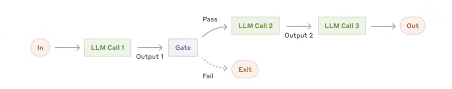
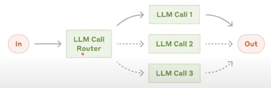
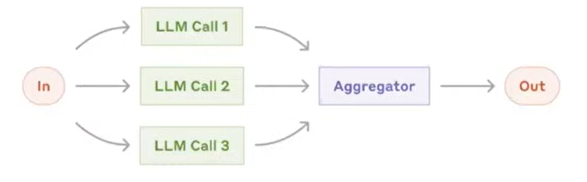
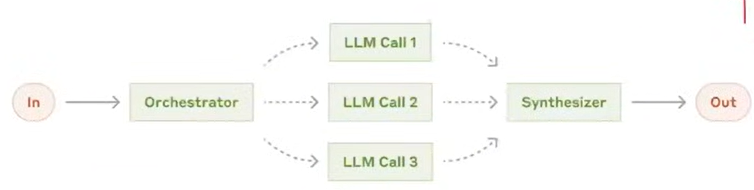
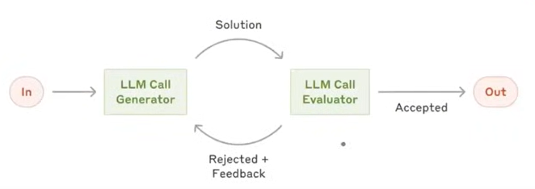
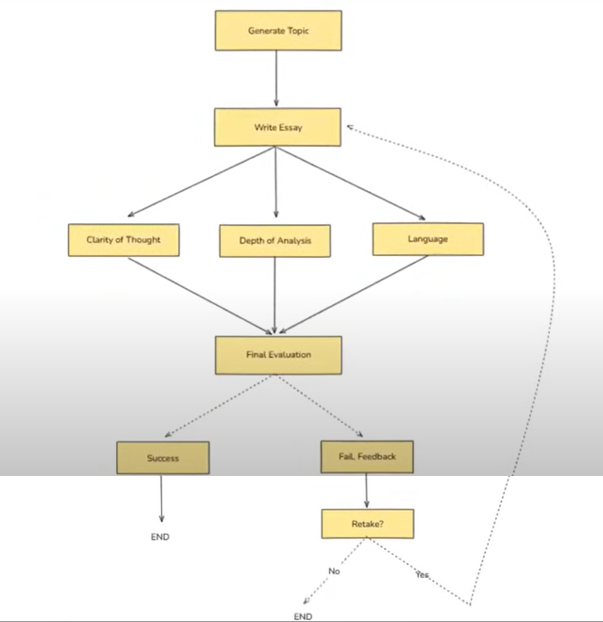

# **Features of Agentic AI Chatbots**

##### 1. **Autonomy**

* **Goal-driven behavior**: Can independently set subgoals and execute tasks toward a main objective.
* **Initiative taking**: Acts without waiting for user prompts (e.g., offering to do something based on context).
* **Long-term memory**: Remembers user preferences, goals, or past interactions to adjust future behavior.
* **Session continuity**: Maintains context across sessions and resumes where left off.

##### 2. **Reasoning & Planning (Cognitive Capabilities)**

* **Multi-step task planning**: Breaks down complex tasks into logical sequences.
* **Chain-of-thought reasoning or Logical chaining**: Explains steps in its decision-making.
* **Constraint handling**: Considers limitations, deadlines, and conflicting objectives.

##### 3. **Adaptability & Continuous Learning**

* **On-the-fly learning**: Learns from new data or user feedback during interaction.
* **Personalization**: Customizes responses based on user personality, tone, and goals.
* **Behavioral adjustment or feedback loop**: Adapts strategy based on success/failure of previous actions.
* **Retraining from Logs or Feedback**: Can fine-tune on domain-specific logs (e.g., support chats, tickets, resolutions), Incorporates user corrections into behavior.
* **Self-improvement Objectives**: Monitors KPIs (e.g., success rate, time to solve) and adjusts strategies to improve.
* **Plugin / Tool Performance Scoring**: Tracks which plugins/tools work best in different contexts and prioritizes them.

##### 4. **Advanced Natural Language Processing**

* **Contextual understanding or Multi-turn dialogue**: Tracks and interprets ongoing conversation with awareness of history.
* **Multi-modal input**: Understands text, voice, image, and file inputs.
* **Multi-language support**: Communicates fluently in multiple languages.
* **Sentiment and intent detection**: Understands user mood and purpose.

##### 5. **Multi-turn Dialogue Handling**

* **Back-and-forth flow**: Handles long, complex conversations without losing track.
* **Clarification prompts**: Asks questions to resolve ambiguity.
* **Interrupt and resume**: Can handle interruptions gracefully and return to previous tasks.

##### 6. **Autonomous Task Execution using Tool & Integration**

* **Tool calling**: Can use external tools/APIs like search engines, calculators, databases, etc.
* **App/plugin integrations**: Interfaces with calendars, CRMs, emails, etc.
* **Multi-agent collaboration**: Coordinates with other AI agents or humans for complex workflows.

##### 7. **Environment Interaction**

* **Web browsing**: Searches and extracts relevant, up-to-date info.
* **File handling**: Reads/writes documents, code, spreadsheets.
* **Real-world API actions**: Sends emails, schedules meetings, creates tickets, triggers workflows.

##### 8. **Control & Alignment & Ethics & Governance & Security & Compliance**

* **Value alignment**: Ensures behavior aligns with user values and ethical norms.
* **Safety constraints or Data privacy**: Obeys guardrails like do-not-do rules or data privacy laws.
* **Explainability**: Can explain why it took a particular action.
* **User approval gating**: Seeks permission before executing sensitive tasks.
* **Escalation to Human Agents / Human-in-the-Loop / Hybrid Control**: Seamlessly hands off to a human when the task is too ambiguous, risky, or sensitive, Includes full context transfer to the human counterpart.
* **Approval-based Actions**: Certain actions (e.g., sending payment, deleting data) require explicit human approval.
* **Role-based Access Control (RBAC)**: User-specific permissions for executing sensitive or destructive tasks, Fine-grained control over tool access (e.g., only admins can call `delete_user`).
* **Audit Logging**: Logs all actions taken by the agent: what, why, when, who initiated, Helps with compliance (e.g., GDPR, HIPAA, SOC2).
* **Prompt Injection & Jailbreak Detection**: Real-time detection and mitigation of malicious inputs or prompt tampering, Input sanitization and containment strategies.
* **Secure Tool Execution**: Runs shell commands, code, or tools in sandboxes or containers (e.g., Docker, Firecracker), Prevents code execution from escaping the controlled environment.

##### 9. **Agentic Architecture & Infrastructure Support**

* **Memory modules**: Separate short-term and long-term memory systems.
* **Planning modules**: Components responsible for action sequencing and prioritization.
* **Critique/self-reflection modules or long-term adaptation**: Evaluates its own performance and revises plans.
* **High Availability & Fault Tolerance**: Distributed deployment to ensure no single point of failure, Auto-recovery from crashes or broken task chains, Retry mechanisms for failed steps or external API timeouts.
* **Scalability**: Supports dynamic workload scaling (horizontal/vertical), Multi-user and multi-agent orchestration without latency spikes.
* **Task Persistence & Resumability**: Can pause and resume long-running tasks (e.g., across sessions or after server restart), Tracks task state in a persistent store (e.g., Redis, vector DB, etc.).

##### 10. **Multi-agent Systems**

* **Task delegation**: Assigns subtasks to specialized agents.
* **Collaboration protocols**: Communicates and negotiates between agents.
* **Shared memory/context**: Maintains a common knowledge base across agents.
* **Multi-agent Task Arbitration**: Agents can negotiate or vote on decisions, Conflict resolution protocols (e.g., consensus, majority, rule-based overrides).

##### 11. **Operations & Lifecycle Management**

* **Versioning & Rollbacks**: Tracks versions of agents, tools, prompts, and plans, Can revert to previous configurations or workflows if issues arise.
* **Dynamic Agent Configuration**: Allows real-time agent behavior tuning (e.g., temperature, planning depth, etc.) via UI or API, Agents can be upgraded, disabled, or redirected on the fly.
* **Hot-Swapping Skills/Tools**: Dynamically load/unload plugins/tools/APIs, Auto-discover or fetch new capabilities from registries or repositories.

##### 12. **Agent Collaboration & Governance**

* **Agent Hierarchies and Delegation Policies**: Agents can spawn or command sub-agents with scoped permissions, Parent-child agent task hierarchies for traceability and control.
* **Agent Registry and Metadata**: Central registry of available agents with descriptions, capabilities, and usage metrics.

##### 13. **Observability & Debugging**
* **Task Traceability / Visual Logs**: Full, step-by-step visual trace of agent thinking and actions, Allows debugging task failures or incorrect reasoning chains.
* **Health Monitoring & Alerts**: Real-time status of agent, tools, and memory systems, Auto-alerts on degraded performance or failures.
* **Feedback Loops**: User thumbs-up/down or comments directly impact agent scoring or future planning.

##### 14. **Domain Adaptation & Knowledge Management**
* **Enterprise Knowledge Graphs / Ontologies**: Integrates with structured data systems (e.g., product catalogs, internal wikis), Links concepts intelligently for richer reasoning.
* **Vector Store-Backed Memory**: Stores long-term memory, embeddings, and documents in semantic vector databases (e.g., Pinecone, Weaviate), Enables retrieval-augmented generation (RAG) across domain-specific knowledge.

| Domain & Industry  | Example Use Case                                                               |
| ------------------ | ------------------------------------------------------------------------------ |
| Personal Assistant | Proactively scheduling your week based on past habits and upcoming goals       |
| Customer Service   | Troubleshooting, escalating, and resolving issues across channels autonomously |
| Development Agent  | Writing, testing, debugging, and documenting code automatically                |
| Research Assistant | Gathering data, summarizing papers, generating insights with minimal guidance  |
| Operations Agent   | Monitoring dashboards, automating responses, adjusting parameters dynamically  |
| Finance            | RBAC, audit logs, human approval for transactions                              |
| Healthcare         | HIPAA compliance, secure memory, human escalation for diagnoses                |
| Customer Support   | Auto-escalation, hot-swapping tools, retraining from logs                      |
| DevOps             | Shell sandboxing, retries, rollback systems                                    |
| E-commerce         | Knowledge graph for products, scalable memory, RAG with order history          |

##### Basic Chatbot Features
* **Quick Replies / Buttons** UI shortcuts to guide conversation.
* **Fallback Handling**       Gracefully manages unknown inputs ("Sorry, I didn’t understand").
* **FAQs Handling**           Responds instantly to predefined frequent questions.
* **Multichannel Support**    Works across web, WhatsApp, Messenger, etc.
* **Typing Indicators**       Shows bot is "typing" for realism.
* **Conversation Handoff**    Transfers to human when needed.
* **User Session Timeout**    Ends or resets inactive chats cleanly.
* **Language Detection**      Auto-detects and switches language if needed.
* **Small Talk**              Handles greetings, jokes, chit-chat.
* **Anonymity Option**        Can chat without needing personal data.

# Agentic AI using LangGraph

NOTE: We can use any other framework to make the Agentic AI, however, we are using LangChain.


## Curriculum: 
1. Foundation of Agentic AI
2. LangGraph Fundamentals
3. Advanced LangGraph
4. AI Agents
5. Agentic RAG
6. Productanization

## Generative AI vs Agentic AI

### Generative AI refers to a class of artificial intelligence models that can create new content - such as text, images, audio, video, or code - that resembles human-created data. Generative AI is about learning the distribution of data so that it can generate a new sample from it, while, Traditional AI is about fining patterns in data and giving predictions. Example: ChatGPT, CodeLLama, Delli, Elevenlabs, Sora etc are used to creative and business writing, software development, customer support, eduction, designing, . It is constantly evolving and improving. Generative AI or LLM can generate generic data but, RAG base AI or LLM generate specific data for my use, but, both don't have memory, cannot take action and reactive (only give response to a query, never initiated itself reply or action).  

### Agentic AI aims at solving a problem using generative AI and take approval/review from the client before taking action. It is proactive (autonomous i.e. can initiate action itself), has memory to remember past, give specific ouput/data, take take action and can adopt to any unseen changes. Example: we can integrate API of services and Agentic AI can use the API to perform the specified task end to end.

# What is Agentic AI?
Agentic Al is a type of Al that can take up a task or goal from a user and then work toward completing it on its own, with minimal human guidance. It plans, takes action, adapts to changes, and seeks help only when necessary.

## Key characterstics of Agentic AI
###  Autonomous
Autonomy refers to the Al system's ability to make decisions and take actions on its own to achieve a given goal, without needing step-by-step human instructions.

1. Our Al recruiter is autonomous

2. It's proactive

3. Autonomy in multiple facets

- Execution
- Decision making
- Tool usage

4. Autonomy can be controlled

- **Permission Scope** - Limit what tools or actions the agent can perform independently. (Can screen candidates, but needs approval before rejecting anyone.)
- **Human-in-the-Loop (HITL)** - Insert checkpoints where human approval is required before continuing. (Can I post this JD)
- **Override Controls** - Allow users to stop, pause, or change the agent's behaviour at any time. (pause screening command to halt resume processing.)
- **Guardrails / Policies** - Define hard rules or ethical boundaries the agent must follow. (Never schedule interviews on weekends)

5. Autonomy can be dangerous

- The application autonomously sends out job offers with incorrect salaries or terms.
- The application shortlists candidates by age or nationality, violating anti-discrimination laws. 
- The applications spending extra on Linkedin ads.

### Goal Oriented
Being goal-oriented means that the Al system operates with a persistent objective in mind and continuously directs its actions to achieve that objective, rather than just responding to isolated prompts.

1. Goals acts as a compass for Autonomy

2. Goals can come with constraints

3. Goals are stored in core memory

```json
{
"main_goal": "Hire a backend engineer",
"constraints": {
    "experience":"2-4 years",
    "remote": true,
    "stack": ["Python", "Django", "Cloud"]
},
"status": "active",
"created_at":"2025-06-27",
"progress": {
    "JD_created": true,
    "posted_on": ["LinkedIn", "AngelList"],
    "applications_received": 8,
    "interviews_scheduled": 2
    }
}
```

4. Goals can be altered

### Planning
Planning is the agent's ability to break down a high-level goal into a structured sequence of actions or subgoals and decide the best path to achieve the desired outcome.

Step 1: Generating multiple candidate plans
- Plan A: Post JD on LinkedIn, GitHub Jobs, AngelList
- Plan B: Use internal referrals and hiring agencies

Step 2: Evaluate each plan
- Efficiency (Which is faster?)
- Tool Availability (Which tools are available)
- Cost (Does it require premium tools?)
- Risk (Will it fail if we get no applicants?)
- Alignment with constraints (remote-only? budget?)

Step 3: Select the best plan with the help of:
- Human-in-the-loop input (e.g., "Which of these options do you prefer?")
- A pre-programmed policy (e.g., "Favor low-cost channels first")

### Reasoning

Reasoning is the cognitive process through which an agentic ai system interprets information, draws conclusions, and makes decisions - both while planning ahead and while executing actions in real time.

**Reasoning During Planning**:

1. **Goal decomposition** - Break down abstract goals into concrete steps
2. **Tool selection** - Decide which tools will be needed for which steps
3. **Resource estimation** - Estimate time, dependencies, risks

**Reasoning During Execution**:

1. **Decision-making** - Choosing between options (3 candidates match → schedule 2 best, reject 1) 
2. **HITL handling** - Knowing when to pause and ask for help (Unsure about salary range)
3. **Error handling** - Interpreting tool/API failures and recovering

### Adaptability

Adaptability is the agent's ability to modify its plans, strategies, or actions in response to unexpected conditions - all while staying aligned with the goal.

1. Failures (Calendar API)
2. External feedback (Less no of applications)
3. Changing goals (Hiring a freelancer)

### Context Awareness

Context awareness is the agent's ability to understand, retain, and utilize relevant information from the ongoing task, past interactions, user preferences, and environmental cues to make better decisions throughout a multi-step process.
1. **Types of context**

- **The original goal**
- **Progress till now + Interaction history** (Job description was finalized and posted to LinkedIn & GitHub Jobs)
- **Environment state** (Number of applicants so far = 8 or LinkedIn promotion ends in 2 days)
- **Tool responses** (Resume parser → "Candidate B has 3 years Django + AWS experience or Calendar API "No conflicts at 2 PM Wednesday)
- **User specific preferences** (Prefers remote-first candidates or Likes receiving interview questions in a Google Doc)
- **Policy or Guardrails**(Do not send offer without explicit user approval or Never use platforms that require paid ads unless approved)

2. **Context awareness is implemented through memory**

3. **Short term memory**

4. **Long term memory**

## Components of Agentic AI
### **Brain**

**Goal Interpretation** : Understands user instructions and translates them into objectives.
**Planning** : Breaks down high-level goals into subgoals and ordered steps.
**Reasoning** : Makes decisions, resolves ambiguity, and evaluates trade-offs.
**Tool Selection** : Chooses which tool(s) to use at a given step.
**Communication** : Generates natural language outputs for humans or other agents.
example: llm

### **Orchestrator**

**Task Sequencing** : Determines the order of actions (step 1-step 2 →...).
**Conditional Routing** : Directs flow based on context (e.g., if failure, retry or escalate).
**Retry Logic** : Handles failed tool calls or reasoning attempts with backoff.
**Looping & Iteration** : Repeats steps (e.g., keep checking job apps until 10 are received).
**Delegation** : Decides whether to hand off work to tools, LLM, or human.
example: LangGraph, Microsoft AutoGen, CrewAI and Semantic Kernel etc.

### **Tools**

**External Actions** : Perform API calls (e.g., post a job, send an email, trigger onboarding).
**Knowledge Base Access** : Retrieve factual or domain-specific information using RAG or search tools to ground responses.
example: API

### **Memory**

**Short-Term Memory** : Maintains the active session's context-recent user messages, tool calls, and immediate decisions.
**Long-Term Memory** : Persists high-level goals, past interactions, user preferences, and decisions across sessions.
**State Tracking** : Monitors progress: what's completed, what's pending (e.g., "JD posted", "Offer sent").

### **Supervisor**

**Approval Requests (HITL)** : Agent checks with human before high-risk actions (e.g., sending offers).
**Guardrails Enforcement** : Blocks unsafe or non-compliant behavior.
**Edge Case Escalation** : Alerts humans when uncertainty/conflict arises.

# What is Langchain?
LangChain is an open-source library designed to simplify the process of building LLM based applications. It provides modular building blocks that let you create sophisticated LLM-based workflows with ease. LangChain can be used to create Simple conversational workflows like Chatbots, Text Summarizers, Multistep workflows, RAG applications, Basic level agents etc.

### LangChain consists of multiple components
- **Model** components gives use a unified interface to interact with various LLM providers
- **Prompts** component helps you engineer prompts
- **Retrievers** component helps you fetch relevant documents from a vector store
- **Chains** component helps to create chain of more than one langchain components.

# What is LangGraph?
**LangGraph** is an orchestration framework that enables you to build **stateful**, **multi-step**, and **event-driven** workflows using large language models (LLMs). It's ideal for designing both **single-agent** and **multi-agent** agentic Al applications.
Think of LangGraph as a **flowchart engine for LLMs** - you define the steps (nodes), how they're connected (edges), and the logic that governs the transitions. LangGraph takes care of **state management**, **conditional branching**, **looping**, **pausing/resuming**, and **fault recovery** - features essential for building robust, production-grade Al systems.

### LangChain Vs LangGraph
- Workflow used in LangChain is created by developer and remain the same, while workflow used in LangGraph is created by the LLM by directing their own processes and tool usage, mainitaining control over how they accomplish tasks.
- LangChain is stateless an, while LangGraph is statefull.
- LangChain is used when you're building simple, linear workflows like a prompt chain, summarizer, or a basic retrieval system, while LangGraph is used when the case involves complex, non-linear workflows that need Conditional paths, Loops, Human-in-the-loop steps, Multi-agent coordination, Asynchronous or event-driven execution etc.

### Why LangGraph exits?

- **Control Flow Complexity** in LangChain because of glue codes (conditional branches, jumps and loops), while no glue code in LangGraph.
- dificulty in **State Handling** (**Data handling**) i.e. manually have to update the state of the workflow, while in LangGrahp, we create a state object with the help of Pydantic or typedict and each node get the state update its value and return the state again.
- LangChain execute in **sequential** fashion, while LangGraph do **Event Driven** Execution.
- LangChain is not **Fault Tolerant** than LangGraph. LangGraph offer small level fault (retry logic), big/system level fault (recovery using checkpointers). 
- LangChain cannot handle **Human in the Loop** for long time.
- **Nested Workflows** each node in the graph can itself be a complete graph. the subgraphs created using it helps to create multiagent system and increase reusability.
- **Observability** is partial and difficult in LangChain, but easy in LangGraph. This is one using **LangSmith**.
- LangGraph is built on top of LangChain (LangGraph doesn't replace LangChain). LangGraph handles workflow orchestration, while LangChain provides the building blocks (ChatOpenAI (LLMs), PromptTemplate, Retrievers, Document Loaders, Tools, etc.) for each step in that workflow.

### LLM workflow
1. LLM workflows are a step by step process using which we can build complex LLM applications.
2. Each step in a workflow performs a distinct task - such as prompting, reasoning, tool calling, memory access, or decision-making.
3. Workflows can be linear, parallel, branched, or looped, allowing for complex behaviours like retries, multi-agent communication, or tool-augmented reasoning.
4. Common workflows






### Graphs, Nodes and Edges
The system generates an essay topic, collects the student's submission, and evaluates it in parallel on depth of analysis, language quality, and clarity of thought. Based on the combined score, it either gives feedback for improvement or approves the essay.

1. **Generate Topic**
- System generates a relevant UPSC-style essay topic and presents it to the student.
2. **CollectEssay**
- Student writes and submits the essay based on the generated topic.
3. **EvaluateEssay (Parallel Evaluation Block)**
- Three evaluation tasks run in **parallel**:
- **EvaluateDepth** - Analyzes depth of analysis, argument strength, and critical thinking.
- **EvaluateLanguage** - Checks grammar, vocabulary, fluency, and tone.
- **EvaluateClarity** - Assesses coherence, logical flow, and clarity of thought.
4. **AggregateResults**
- Combines the three scores and generates a total score (e.g., out of 15).
5. **Conditional Routing**
- Based on the total score:
- If score meets threshold go to ShowSuccess
- If score is below threshold go to GiveFeedback
6. **GiveFeedback**
- Provides targeted suggestions for improvement in weak areas.
7. **CollectRevision** (optional loop)
- Student resubmits the revised essay.
- Loop back to **EvaluateEssay**
8. **ShowSuccess**
- Congratulates the student and ends the flow.




### State
In LangGraph, state is the shared memory that flows through your workflow - it holds all the data being passed between nodes as your graph runs.

```python
    essay text: str
    topic: str
    depth_score: int
    language_score: int
    clarity_score: int
    total_score: int
    feedback: Annotated [list[str], add]
    evaluation_round: int
```

### Reducers,
Reducers in LangGraph define how updates from nodes are applied to the shared state. Each key in the state can have its own reducer, which determines whether new data replaces, merges, or adds to the existing value.

### LangGraph Execution Model

It is inspired by Google Pragal that processes large scale graphs.

1. **Graph Definition**

You define:
- The **state schema**
- **Nodes** (functions that perform tasks)
- **Edges** (which node connects to which)

2. **Compilation**

You call `.compile()` on the `StateGraph`. This checks the graph structure and prepares it for execution.

3. **Invocation**

You run the graph with `.invoke(initial_state)`. LangGraph sends the initial state as a **message** to the entry node(s).

4. **Super-Steps Begin**
Execution proceeds in **rounds**. In each round (super-step):
- All **active nodes** (those that received messages) run in **parallel**
- Each returns an **update** (message) to the state

5. **Message Passing & Node Activation**
The messages are passed to downstream nodes via edges. Nodes that receive messages become active for the **next round**.

6. **Halting Condition**
Execution stops when:
- No nodes are active, and
- No messages are in transit

## Sequential Workflows

## Parallel Workflows

## Conditional Workflows

## Iterative Workflows