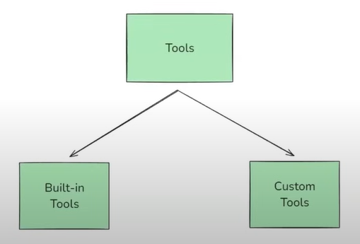
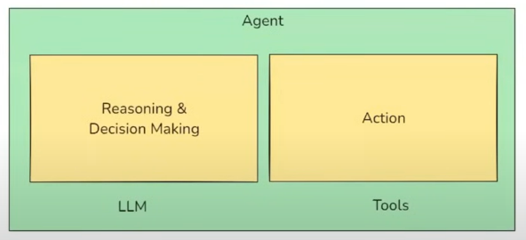
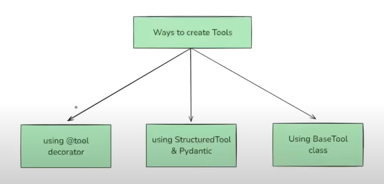

# LangGraph

**LangChain** is an open-source library designed to simplify the process of building LLM-based applications. It provides modular building blocks that let you create sophisticated LLM-based workflows with ease. LangChain can be used to create simple conversational workflows like Chatbots, Text Summarizers, Multistep workflows, RAG applications, and basic agents. LangChain consists of multiple components :
- **Model** : components give us a unified interface to interact with various LLM providers.
- **Prompts** : component helps you engineer and manage prompts.
- **Retrievers** : component helps you fetch relevant documents from a vector store.
- **Chains** : component helps to link multiple LangChain components together.

**LangGraph** is an orchestration framework that enables you to build `stateful`, `multi-step`, and `event-driven` workflows using LLMs. It is ideal for designing both `single-agent` and `multi-agent` agentic AI applications. Think of LangGraph as a flowchart engine for LLMs - you define the steps `nodes`, how they're connected `edges`, and the logic that governs the transitions. LangGraph takes care of `state management`, `conditional branching`, `looping`, `pausing/resuming`, and `fault recovery` - features essential for building robust, production-grade AI systems.

## **LangChain** vs **LangGraph**
Workflows used in LangChain are typically `created by the developer` and remain static, while workflows in LangGraph can be `dynamically directed by the LLM`, maintaining control over how tasks are accomplished. LangChain is `stateless`, while LangGraph is `stateful`.

LangChain is used when building `simple`, `linear workflows` like a prompt chain, summarizer, or a basic retrieval system. However, handling complexity in LangChain often requires "glue code" (conditional branches, jumps, and loops). In contrast, LangGraph is used for `complex`, `non-linear workflows` that need `conditional paths`, `loops`, `human-in-the-loop` steps, `multi-agent` coordination, `event-driven execution`, and `asynchronous execution`. LangChain faces difficulty in State Handling (data handling), often requiring manual updates to the workflow state. In LangGraph, we create a state object (using Pydantic or TypedDict); each node receives the state, updates its value, and returns the state again.

Other distinctions:
- `Execution`: LangChain executes in a sequential fashion, while LangGraph performs Event-Driven execution.
- `Fault Tolerance`: LangGraph offers handling for small-level faults (retry logic) and system-level faults (recovery using checkpointers) by starting from the intermediate state `workflow.get_state_history(config)` in case of crash instead of starting from the initial.
- `Human-in-the-loop`: LangChain cannot handle Human-in-the-loop for long-running processes effectively. But, LangGrahp makes the Agentic AI to wait for human response before execution. It work the same way as fault tolerance by knowingly done.
- `Nested Workflows`: In LangGraph, each node can itself be a complete graph. These subgraphs help create multi-agent systems and increase reusability.
- `Observability`: This is partial and difficult in LangChain but easier in LangGraph.

 *Note: LangGraph is built on top of LangChain (it doesn't replace it). LangGraph handles workflow orchestration, while LangChain provides the building blocks (LLMs, PromptTemplates, Retrievers, Document Loaders, Tools, etc.) for each step.*

**LLM Workflows** are step-by-step processes used to build complex LLM applications. Each step in a workflow performs a distinct task—such as prompting, reasoning, tool calling, memory access, or decision-making. Workflows can be linear, parallel, branched, or looped, allowing for complex behaviors like retries, multi-agent communication, or tool-augmented reasoning. Common workflows include Prompt Chaining, Routing, Parallelization, Orchestrator Workers, and Evaluator Optimizer.

**State** in LangGraph is the shared memory that flows through your workflow. It holds all the data being passed between nodes as your graph runs.

**Reducers** in LangGraph define how updates from nodes are applied to the shared state. Each key in the state can have its own reducer, which determines whether new data replaces, merges, or adds to the existing value. Like `add_messages` is a Reducer function to prevent from preventing erasing when adding the new message.


**Execution Flow**

You define the `state schema`, followed by the `Nodes` (functions that perform tasks) and `Edges` (which node connects to which). You call `.compile()` on the `StateGraph`. This checks the graph structure and prepares it for execution. You run the graph with `.invoke(initial_state)`. LangGraph sends the initial state as a `message` to the entry node(s). Execution proceeds in `rounds`. In each round (super-step), all `active nodes` (those that received messages) run in `parallel`, and each returns an `update` (message) to the state. The messages are passed to downstream nodes via edges. Nodes that receive messages become active for the `next round`. Execution stops when no nodes are active or no messages are in transit.

 
 


## Types of Workflows:

### Sequential Workflows
```python
graph.add_node('create_outline',create_outline)
graph.add_node('create_blog',create_blog)
graph.add_node('score_blog',score_blog)

graph.add_edge(START, 'create_outline')
graph.add_edge('create_outline', 'create_blog')
graph.add_edge('create_blog', 'score_blog')
graph.add_edge('score_blog', END)
```

### Parallel Workflows
 NOTE: In parallel workflow, each nodes must return the required part of the state only. While, for others we can send the whole state. But, to keep it simple, we can just use required part of the state for nodes.

```python
graph.add_node("evaluate_language", evaluate_language)
graph.add_node("evaluate_analysis", evaluate_analysis)
graph.add_node("evaluate_thought", evaluate_thought)
graph.add_node("final_evaluation", final_evaluation)

graph.add_edge(START, "evaluate_language")
graph.add_edge(START, "evaluate_analysis")
graph.add_edge(START, "evaluate_thought")
graph.add_edge("evaluate_language", "final_evaluation")
graph.add_edge("evaluate_analysis", "final_evaluation")
graph.add_edge("evaluate_thought", "final_evaluation")
graph.add_edge("final_evaluation", END)
```

### Conditional Workflows
```python
graph.add_node('find_sentiment', find_sentiment)
graph.add_node('positive_response', positive_response)
graph.add_node('run_diagnosis', run_diagnosis)
graph.add_node('negative_response', negative_response)

graph.add_edge(START, 'find_sentiment')
graph.add_conditional_edges('find_sentiment', check_sentiment) # check_condition will fit the correct function.

graph.add_edge('positive_response', END)

graph.add_edge('run_diagnosis', 'negative_response')
graph.add_edge('negative_response', END)
```

### Iterative Workflows
```python
graph.add_node('generate_tweet', generate_tweet)
graph.add_node('evaluate_tweet', evaluate_tweet)
graph.add_node('optimize_tweet', optimize_tweet)

graph.add_edge(START, 'generate_tweet')
graph.add_edge('generate_tweet', 'evaluate_tweet')

graph.add_conditional_edges('evaluate_tweet', route_evaluation)

graph.add_edge('approved', END)

graph.add_edge('needs_improvement', 'optimize_tweet') # calling back the optimize_tweet function for iteration
graph.add_edge('optimize_tweet', 'evaluate_tweet')
```

  

# Agentic AI

**Generative AI** refers to a class of artificial intelligence models that can create new content - such as text, images, audio, video, or code - that resembles human-created data. Generative AI is about learning the distribution of data so that it can generate a new sample from it, while, Traditional AI is about fining patterns in data and giving predictions. Example: ChatGPT, CodeLLama, Delli, Elevenlabs, Sora etc are used to creative and business writing, software development, customer support, eduction, designing, . It is constantly evolving and improving. Generative AI or LLM can generate generic data but, RAG base AI or LLM generate specific data for my use, but, both don't have memory, cannot take action and reactive (only give response to a query, never initiated itself reply or action).

 **Agentic AI** aims at solving a problem using generative AI and take approval/review from the client before taking action. It is proactive (autonomous i.e. can initiate action itself), has memory to remember past, give specific ouput/data, take take action and can adopt to any unseen changes. Example: we can integrate API of services and Agentic AI can use the API to perform the specified task end to end. Agentic Al is a type of Al that can take up a task or goal from a user and then work toward completing it on its own, with minimal human guidance. It plans, takes action, adapts to changes, and seeks help only when necessary. It is an intelligent system that receives a high-level goal from a user, and autonomously plans, decides, and executes a sequence of actions by using external tools, APIs, or knowledge sources — all while maintaining context, reasoning over multiple steps, adapting to new information, and optimizing for the intended outcome.

## **Features of Agentic AI Chatbots**

### 1. **Autonomous, Adaptability & Goal Oriented**
 **Autonomy** refers to the AI system's ability to make decisions, Tool usage and take actions on its own to achieve a given goal, without needing step-by-step human instructions.

 **Goal-oriented** means AI system that understands user instructions and translates them into objectives and operates with a persistent objective in mind and continuously directs its actions to achieve that objective, rather than just responding to isolated prompts. Independently set subgoals and execute tasks toward a main objective.

 **Adaptability** is the agent's ability to modify its plans, strategies, or actions in response to unexpected conditions (Failures, External feedback and Changing goals etc.) - all while staying aligned with the goal.

 **Initiative taking**: Acts without waiting for user prompts (e.g., offering to do something based on context).
 **Session continuity**: Maintains context across sessions and resumes where left off.

To controll the Autonomy :
- **Permission Scope** - Limit what tools or actions the agent can perform independently. (Can screen candidates, but needs approval before rejecting anyone.)
- **Human-in-the-Loop (HITL)** - Insert checkpoints where human `approval`, `supervise`, `correct` and `guide` is required before continuing `high-risk actions` thus add accountability, accuracy, ethical aligment, better user experience to human. HITL pause the execution and save the state to take Human input and resume the execution when receive the user's feedback. Also Alerts when uncertainty/conflict arises. Common HITL pattters are  `action approval` pattern, `output review / edit` Pattern, `ambiguity clarification` pattern, `escalation` pattern.
- **Override Controls** - Allow users to stop, pause, or change the agent's behaviour at any time. (pause screening command to halt resume processing.)
- **Guardrails / Policies** - Define hard rules or ethical boundaries the agent must follow and Blocks unsafe or non-compliant behavior. (Never schedule interviews on weekends)

### 2. **Reasoning & Planning (Cognitive Capabilities)**

 **Reasoning** is the cognitive process through which an agentic ai system interprets information, draws conclusions, resolves ambiguity, evaluates trade-offs and makes decisions - both while planning ahead and while executing actions in real time. Chooses which tool(s) to use at a given step.

 **Planning** is the agent's ability to break down a high-level goal into a structured sequence of actions or ordered subgoals and decide the best path to achieve the desired outcome.

 **Reasoning During Planning**:

1. **Goal decomposition** - Break down abstract goals into concrete steps
2. **Tool selection** - Decide which tools will be needed for which steps
3. **Resource estimation** - Estimate time, dependencies, risks
4. **Multi-step task planning**: Breaks down complex tasks into logical sequences.
5. **Chain-of-thought reasoning or Logical chaining**: Explains steps in its decision-making.
6. **Constraint handling**: Considers limitations, deadlines, and conflicting objectives.

 **Reasoning During Execution**:

1. **Decision-making** - Choosing between options (3 candidates match → schedule 2 best, reject 1) 
2. **HITL handling** - Knowing when to pause and ask for help (Unsure about salary range)
3. **Error handling** - Interpreting tool/API failures and recovering

### 3. **Tool**
A **Tool** is just a Python function (or API) that is packaged in a way the LLM can understand and call when needed. NOTE: tools are also runnables. LLMS (like GPT) are great at Reasoning (Think) and Language generation (Text Generation or Speak) But they can't do things like Access live data (weather, news), Do reliable math (difficult mathematics), Call APIs (post a tweet on tweeter), Run code and Interact with a database. An AI agent is an LLM-powered system that can autonomously think, decide, and take actions using external tools or APIs to achieve a goal. `DockString is must for tools as LLM can only read this to know what that tool does.`

 

**Toolkits**: A toolkit is just a collection (bundle) of related tools that serve a common purpose- packaged together for convenience and `reusability`.
In LangChain, a toolkit might be `GoogleDriveToolKit` and it can contain the following tools ,`GoogleDriveCreateFileTool` (Upload a file) , `GoogleDriveSearchTool` (Search for a file by name/content ), `GoogleDriveReadFileTool` (Read contents of a file).

**Tool Binding** is the step where you register tools with a Language Model (LLM) so that the LLM knows what tools are available, what each tool does (via description) and what input format to use (via schema).

**Tool Calling** is the process where the LLM decides, during a conversation or task, that it needs to use a specific tool (external tools/APIs like search engines, calculators, databases, post a job, send an email, trigger onboarding etc.) and generates a structured output with the `name of the tool` and the `arguments` to call it with. The LLM `does not actually run the tool`, it just `suggests` the tool and the input arguments. The `actual execution is handled by LangChain or you`.

**ToolNode** in LangGraph, is a prebuilt node type that acts as a bridge between your graph and external tools (functions, APIs, utilities). Normally in LangGraph you'd write a node function yourself. It takes in state and returns state. It is a ready-made node that knows how to handle a list of LangChain tools. Its job is to listen for tool calls from the LLM like `call search()` or `get_weather()` and automatically route the request to the correct tool, then pass the tool's output back into the graph.

**tools_condition** is a prebuilt conditional edge function that helps your graph decide `Should the flow go to the ToolNode next, or back to the LLM?`

**Tool Execution** is the step where the `tool` is run using the input arguments that the **LLM suggested during tool calling**.

- **Built-in Tools**: A tool that is pre-built, production- ready, and requires minimal or no setup. You don't have to write the function logic yourself - you just import and use it. Example:- DuckDuckGoSearchRun and WikipediaQueryRun etc.

- **Custom Tools** : A tool that you define yourself. Example: calling custom APIs, encapsulate business logic, interact with your database, product, or app etc. Ways to create Custom Tools are @tool decorator, Structured Tool & Pydantic and Base Tool class.
 

    - **Structured Tool** in LangChain is a special type of tool where the input to the tool follows a structured schema, typically defined using a Pydantic model. The best way to make enforce constants and most used in production.

    - **BaseTool** is the abstract base class for all tools in LangChain. It defines the core structure and interface that any tool must follow, whether it's a simple one-liner or a fully customized function. All other tool types like `@tool`, `Structured Tool` are built on top of BaseTool. Used to perform multiple asynchronous functions unlike in tool decorator and Structured Tool.

**Model Context Protocol (MCP)** is an open standard for linking LLMs and AI with external data and tools (like databases, APIs, files) to give them real-world context, making AI more accurate and capable, similar to HTTP for web browsing. Like `Google Drive connectors` for document access & collaboration and `GitHub integrations` for code review & pull request management. It reduces integrations from `N × M` to `N + M`.
MCP is needed because Multiple AI tools operate in silos with no interoperability, AI in one tool (e.g., Notion) cannot communicate with AI in another (e.g., Slack), Developers face "copy-paste hell" where context assembly takes more time than actual development and Integration issues like `N × M development complexity`, `Different authentication methods`, `Different data formats` and `API patterns and Different error handling approaches` and maintenance issues like `Security fragmentation`, `High cost and time wastage`. MCP uses async functions so all chatbot must be async too (parallel execution can be done). Also, MCP contains server (code written by Companies like GitHub, Google etc. we just run the code on our server with API KEYs and the server talk to the GitHub and Google APIs) and client (persist on chatbot code and make request to MCP server).

```python
client = MultiServerMCPClient(
    {
        "pubmed": { # To search biomedical literature
            "transport": "sse",  # Remote servers always use 'sse'
            "url": "https://pubmed.mcp.claude.com/sse"
        }
    }
)
```

**RAG** is a technique that combines information retrieval with language generation, where a model retrieves relevant documents from a knowledge base and then uses them as context to generate accurate and grounded responses. LLM has problem of outdated knowledge, privacy (no knowledge of data we have) and Hallucination (refer to souces but it don't exist in reality). RAG enables `up-to-date information`, `better privacy`, `no limit of document size`. First we loads a document and split into small pages then convert these pages into the vectors using some embedding models and store these vectors and corresponding original text into some vector store like `faiss` and `chroma` etc. for future retrival. We send the query from the user to the retriver and the retriver fatch the related pages from the vector store that are related to the query and pass the pages as `context` and query to LLM for response generation. Before building the embedding, the system checks if an index already exists. If not, it creates an `.indices` folder in the working directory and builds. Build is triggered when `first-ever run` (no cache exists), `PDF content`, `PDF file metadata` (e.g., size), `Chunking parameters` (chunk size/overlap) and `Embedding model` (embedding model) changes. Components of RAG are `Document Loaders`, `Text Splitters`, `Vector Databases` and `Retrievers`.

**Document Loaders** are used to load data from various sources into a standardized format (usually as `Document objects`), which can then be used for chunking, embedding, retrieval, and generation. Most popular document loaders are `TextLoader`, `PyPDFLoader`, `WebBaseLoader`, `CSVLoader` etc. Also we can create a custom Document Loader (https://python.langchain.com/docs/how_to/document_loader_custom/).

- **TextLoader** reads only plain text `.txt` files and converts them into LangChain Document objects. Ideal for loading chat logs, scraped text, transcripts, code snippets, or any plain text data into a LangChain pipeline.

- **WebBaseLoader** loads and extract text content from web pages `URLs`. It uses BeautifulSoup under the hood to parse HTML and extract visible text (what's in the HTML, not what loads after the page renders). Used for blogs, news articles, or public websites where the content is primarily text-based and static. Doesn't handle JavaScript-heavy pages well (use SeleniumURLLoader for that).

- **DirectoryLoader** loads `multiple documents from a directory` of files.
- `**/*.txt`: All .txt files in all subfolders
- `*.pdf`: All .pdf files in the root directory
- `data/*.csv` : All .csv files in the data/ folder
- `**/*`: All files (any type, all folders)
- `**` = recursive search through subfolders

- **CSVLoader** loads `CSV files` into LangChain document objects - `one per row`, by default.

**load()**: loads `everything at once` (Eager Loading) into the memory and `returns a list of document objects`. Best when the number of documents is small. You want everything loaded upfront.

**lazy_load()**: loads `on demand` (Lazy Loading) and `returns a generator of document objects` and which is used to fetched one document object at a time as needed. Best when you're dealing with large documents or lots of files. You want to stream processing (e.g., chunking, embedding) without using lots of memory.

### 4. **Observability & Debugging using LangSmith**
**Observability** is the ability to understand a system's internal state by examining its external outputs, like logs, metrics, and traces. It allows you to diagnose issues, understand performance, and improve reliability by analyzing data generated by the system. Essentially, it's about being able to `answer "why" something is happening within a system`, even if you didn't anticipate the problem. It helps `mitigate hallucination in RAG`, debugging in Agents, and latency in LLMs. Two big problems in LLMs/Agents/Chatbots are `Retriever errors` (wrong / irrelevant documents retrieved) and `Generator errors` (LLM hallucinates or misuses context). In production, it's often unclear if the retriever or LLM caused failure. This is why observability is critical.

**LangSmith** is a unified `observability & evaluation platform` where teams can `debug`, `test`, and `monitor AI app performance`. It tracks execution of application components step by step, capturing at a granular level what input and output each component receives and produces, and the time taken. In LangSmith, `an app` is called a **project**, each `execution` is a **trace**, and each `component’s execution` is called a **run**. LangSmith trace `Input and Output` (User query, LLM prompt (with inserted docs), Retrieved documents and LLM response), `All the intermediate steps`, `Latency`, `Token usage`, `Cost`, `Error`, `Tags`, `Metadata` (helps in search and debugging) and `Feedback`. LangSmith treats an LLM application as a workflow, which can be represented as a graph where each node represents a task. When graphs become complex, debugging and managing them is difficult — LangSmith solves this. Every graph execution is logged in LangSmith as a `trace`. Each node (retriever, LLM, tool call, subgraph, etc.) becomes a `run` inside the trace. If a workflow branches (conditional / parallel / subgraph), LangSmith records which path was executed. By default, LangSmith only tracks the LLM or chain invocation, not PDF loading, chunking, or embedding functions, this can be resolved using `@traceable decorator`. https://smith.langchain.com/

- **Monitoring and Alerting** in LangSmith looks across many traces at once to track the overall health of your LLM system. It aggregates metrics like `latency` (P50, P95, P99), `token usage`, `cost`, `error rates`, and `success rates`. Alerts can be configured to notify you when metrics drift outside acceptable ranges (e.g., `latency spikes`, `higher error rates`, `unexpected cost increases`, `Real-time status of agent`, `tools`, and `memory systems`). In production, issues often appear as patterns across multiple runs rather than in a single trace. Instead of waiting for customer complaints, LangSmith proactively alerts you when performance degrades, enabling faster responses and more reliable applications.

- **Evaluation** in LangSmith measures the quality of LLM outputs. You can `run tests against gold-standard datasets` or apply evaluation metrics like faithfulness, relevance, or completeness. Supported methods include `Automated scoring` (LLM-as-a-judge), `Semantic similarity checks`, `Custom Python evaluators`. Evaluations can run `offline` (batch, pre-deployment) or `online` (continuous on live traffic). LLM behavior is unpredictable (small changes in prompts, models, or retrieval may improve some cases but break others). Evaluation ensures objective, repeatable performance tracking, preventing regressions and validating improvements. For a RAG chatbot, you might evaluate Faithfulness (Are answers grounded in retrieved documents?) and Relevance (Did the response address the user’s question?) by running the same dataset across GPT-4, Claude, and LLaMA, you can compare models or pipeline setups.

- **Prompt Experimentation** LangSmith allows `A/B testing of different prompt versions`. Prompts are tested on the same dataset, evaluated against metrics, and results are logged over time. This builds a history of which prompts perform best under what conditions.

- **Dataset Creation & Annotation** Tools to build datasets for evaluation and fine-tuning. Supports manual annotation (e.g., labeling correctness). Stores versioned datasets for reuse across projects. High-quality datasets are essential for evaluation and feedback loops like Customer support (dataset of common Q&A for benchmarking RAG agent updates).

- **User Feedback Integration** Capture thumbs up/down, ratings, or structured feedback from production users directly impact agent scoring or future planning. Feedback is logged alongside traces, tied to prompts, models, and states. Enables bulk analysis of user preferences.

- **Collaboration** Team members can view, share, and comment on traces, datasets, and evaluations. Web UI enables non-engineers (PMs, QA, annotators) to inspect and annotate runs. Supports shared dashboards for experiments.

### 5. **Context Awareness**
 **Context Awareness** is the agent's ability to understand, retain, and utilize relevant information from the ongoing task, past interactions, user preferences, and environmental cues to make better decisions throughout a multi-step process.

**Types of context** :
- **The original goal**
- **Progress till now + Interaction history** (Job description was finalized and posted to LinkedIn & GitHub Jobs)
- **Environment state** (Number of applicants so far = 8 or LinkedIn promotion ends in 2 days)
- **Tool responses** (Resume parser → "Candidate B has 3 years Django + AWS experience or Calendar API "No conflicts at 2 PM Wednesday)
- **User specific preferences** (Prefers remote-first candidates or Likes receiving interview questions in a Google Doc)
- **Policy or Guardrails**(Do not send offer without explicit user approval or Never use platforms that require paid ads unless approved)

**Persistence** in LangGraph refers to the ability to save and restore the state of a workflow over time. It not just store the initial and  final state but also the intermediate state. It is implemented with the help of **checkpointers**. **Threads** in Persistence helps by assigning Thread ID to each instance of the workflow to retrive that. **Time Travel** allow us to `re-play` or execute the workflow from `any intermediate checkpoint` when there is `no error or failure`. It helps in debugging. We first retrive the Checkpoint ID for a particular node by specifing node name then run workflow from the node. **Updating State** allow us to `re-play` the workflow `with new state` thus the output state will also change.

#### **Types of Memory**: 
 **Short term memory** : Store and maintains the intermediate state (active session's context-recent user messages, tool calls, and immediate decisions across sessions) into the database and retriving the past conversation to resume the conversation.
 **Long term memory** : Remembers user preferences, high-level goals, or past interactions to adjust future behavior.
 **State Tracking** : Monitors progress: what's completed, what's pending (e.g., "JD posted", "Offer sent").

### 6. **Other Common Chatbot Features**
* **Streaming**               Model starts sending tokens (words) as soon as they're generated, instead of waiting for the entire response to be ready before returning it. It has faster response time - low drop-off rates, mimics human like conversation (Builds trust, feels alive and keeps the user engaged), important for Multi-modal Uls, better UX for long output such as code, you can cancel midway saving tokens and you can interleave UI updates, e.g., show "thinking...", show tool results.
* **Quick Replies / Buttons** UI shortcuts to guide conversation.
* **Fallback Handling**       Gracefully manages unknown inputs ("Sorry, I didn’t understand").
* **FAQs Handling**           Responds instantly to predefined frequent questions.
* **Multichannel Support**    Works across web, WhatsApp, Messenger, etc.
* **Typing Indicators**       Shows bot is "typing" for realism.
* **Conversation Handoff**    Transfers to human when needed.
* **User Session Timeout**    Ends or resets inactive chats cleanly.
* **Language Detection**      Auto-detects and switches language if needed.
* **Small Talk**              Handles greetings, jokes, chit-chat.
* **Anonymity Option**        Can chat without needing personal data.

### 7. **Agentic Architecture & Infrastructure Support**

* **Planning modules**: Components responsible for action sequencing and prioritization.
* **Critique/self-reflection modules or long-term adaptation**: Evaluates its own performance and revises plans.
* **High Availability & Fault Tolerance**: Distributed deployment to ensure no single point of failure, Auto-recovery from crashes or broken task chains, Retry mechanisms for failed steps or external API timeouts.
* **Scalability**: Supports dynamic workload scaling (horizontal/vertical), Multi-user and multi-agent orchestration without latency spikes.
* **Task Persistence & Resumability**: Can pause and resume long-running tasks (e.g., across sessions or after server restart), Tracks task state in a persistent store (e.g., Redis, vector DB, etc.).

### 8. **Multi-agent Systems**

* **Task delegation**: Assigns subtasks to specialized agents.
* **Collaboration protocols**: Communicates and negotiates between agents.
* **Shared memory/context**: Maintains a common knowledge base across agents.
* **Multi-agent Task Arbitration**: Agents can negotiate or vote on decisions, Conflict resolution protocols (e.g., consensus, majority, rule-based overrides).

### 9. **Operations & Lifecycle Management**

* **Versioning & Rollbacks**: Tracks versions of agents, tools, prompts, and plans, Can revert to previous configurations or workflows if issues arise.
* **Dynamic Agent Configuration**: Allows real-time agent behavior tuning (e.g., temperature, planning depth, etc.) via UI or API, Agents can be upgraded, disabled, or redirected on the fly.
* **Hot-Swapping Skills/Tools**: Dynamically load/unload plugins/tools/APIs, Auto-discover or fetch new capabilities from registries or repositories.

### 10. **Agent Collaboration & Governance**

* **Agent Hierarchies and Delegation Policies**: Agents can spawn or command sub-agents with scoped permissions, Parent-child agent task hierarchies for traceability and control.
* **Agent Registry and Metadata**: Central registry of available agents with descriptions, capabilities, and usage metrics.

### 11. **Adaptability & Continuous Learning**

* **On-the-fly learning**: Learns from new data or user feedback during interaction.
* **Personalization**: Customizes responses based on user personality, tone, and goals.
* **Behavioral adjustment or feedback loop**: Adapts strategy based on success/failure of previous actions.
* **Retraining from Logs or Feedback**: Can fine-tune on domain-specific logs (e.g., support chats, tickets, resolutions), Incorporates user corrections into behavior.
* **Self-improvement Objectives**: Monitors KPIs (e.g., success rate, time to solve) and adjusts strategies to improve.
* **Plugin / Tool Performance Scoring**: Tracks which plugins/tools work best in different contexts and prioritizes them.

### 12. **Advanced Natural Language Processing**

* **Contextual understanding or Multi-turn dialogue**: Tracks and interprets ongoing conversation with awareness of history.
* **Multi-modal input**: Understands text, voice, image, and file inputs.
* **Multi-language support**: Communicates fluently in multiple languages.
* **Sentiment and intent detection**: Understands user mood and purpose.

### 13. **Multi-turn Dialogue Handling**

* **Back-and-forth flow**: Handles long, complex conversations without losing track.
* **Clarification prompts**: Asks questions to resolve ambiguity.
* **Interrupt and resume**: Can handle interruptions gracefully and return to previous tasks.

### 14. **Environment Interaction**

* **App/plugin integrations**: Interfaces with calendars, CRMs, emails, Retrieve factual or domain-specific information using RAG etc.
* **Multi-agent collaboration**: Coordinates with other AI agents or humans for complex workflows.
* **Web browsing**: Searches and extracts relevant, up-to-date info.
* **File handling**: Reads/writes documents, code, spreadsheets.
* **Real-world API actions**: Sends emails, schedules meetings, creates tickets, triggers workflows.

### 15. **Control & Alignment & Ethics & Governance & Security & Compliance**

* **Value alignment**: Ensures behavior aligns with user values and ethical norms.
* **Safety constraints or Data privacy**: Obeys guardrails like do-not-do rules or data privacy laws.
* **Explainability**: Can explain why it took a particular action.
* **User approval gating**: Seeks permission before executing sensitive tasks.
* **Human-in-the-Loop**: Seamlessly hands off to a human when the task is too ambiguous, risky, or sensitive, Includes full context transfer to the human counterpart.
* **Approval-based Actions**: Certain actions (e.g., sending payment, deleting data) require explicit human approval.
* **Role-based Access Control (RBAC)**: User-specific permissions for executing sensitive or destructive tasks, Fine-grained control over tool access (e.g., only admins can call `delete_user`).
* **Audit Logging**: Logs all actions taken by the agent: what, why, when, who initiated, Helps with compliance (e.g., GDPR, HIPAA, SOC2).
* **Prompt Injection & Jailbreak Detection**: Real-time detection and mitigation of malicious inputs or prompt tampering, Input sanitization and containment strategies.
* **Secure Tool Execution**: Runs shell commands, code, or tools in sandboxes or containers (e.g., Docker, Firecracker), Prevents code execution from escaping the controlled environment.